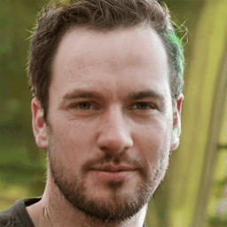
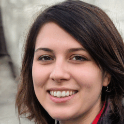
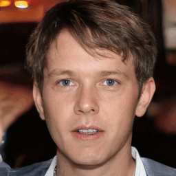

# InterfaceGAN++: Exploring the limits of InterfaceGAN


<p float="left">
  
   
   
   
</p>

> From left to right - Images generated using styleGAN2 and the boundaries *Bald*, *Blond*, *Heavy_Makeup*, *Gray_Hair*

This the the repository to a project related to the [*Introduction to Numerical Imaging*](https://delon.wp.imt.fr/enseignement/mva-introduction-a-limagerie-numerique/) (*i.e, Introduction à l'Imagerie Numérique* in French), given by the MVA Masters program at ENS-Paris Saclay. The project and repository is based on the work from [Shen et al.](https://github.com/younesbelkada/interfacegan/blob/master/README_old.md), and fully supports their codebase. You can refer to the [original README](https://github.com/younesbelkada/interfacegan/blob/master/README_old.md)) to reproduce their results.

## Introduction

> In this repository, we propose an approach, termed as InterFaceGAN++, for semantic face editing based on the work from Shen et al. Specifically, we leverage the ideas from the previous work, by applying the method for new face attributes, and also for StyleGAN3. We qualitatively explain that moving the latent vector toward the trained boundaries leads in many cases to keeping the semantic information of the generated images (by preserving its local structure) and modify the desired attribute, thus helps to demonstrate the disentangled property of the styleGANs. 

## :fire: Additional features

+ Supports styleGAN3 on the classic attributes
+ New attributes (Bald, Gray hair, Blond hair, Earings, ...) for:
  + StyleGAN
  + StyleGAN3
+ Supports face generation using StyleGAN3

The list of new features can be found on our [attributes detection classifier repository](https://github.com/clementapa/CelebFaces_Attributes_Classification/blob/main/utils/constant.py)

## :hammer: Training an attribute detection classifier

We use a ViT-base model to train an attribute detection classifier, please refer to our [classification code](https://github.com/clementapa/CelebFaces_Attributes_Classification) if you want to test it for new models. Once you retrieve the trained SVM from this repo, you can directly move them in this repo and use them.

## :star: Generate images using StyleGAN2 & StyleGAN3

We did not changed anything to the structure of the old repository, please refer to the [previous README](https://github.com/younesbelkada/interfacegan/blob/master/README_old.md).

### :movie_camera: Get the pretrained StyleGAN3

We use the styleGAN3 trained on ffhq for our experiments, if you want to reproduce them, run
```
wget -P models/pretrain https://api.ngc.nvidia.com/v2/models/nvidia/research/stylegan3/versions/1/files/stylegan3-t-ffhq-1024x1024.pkl 
```

The pretrained model should be copied at ``` models/pretrain ```. If not, move the pretrained model file at this directory.

### :art: Run the generation script

If you want to generate images using styleGAN3 downloaded before, run:
```
python generate_data.py -m stylegan3_ffhq -o output_stylegan3 -n 10
```
The arguments are exactly the same as the arguments from the original repository, the code supports the flag ```-m stylegan3_ffhq``` for styleGAN3.

## :pencil2: Edit generated images

You can edit the generated

### Examples=
